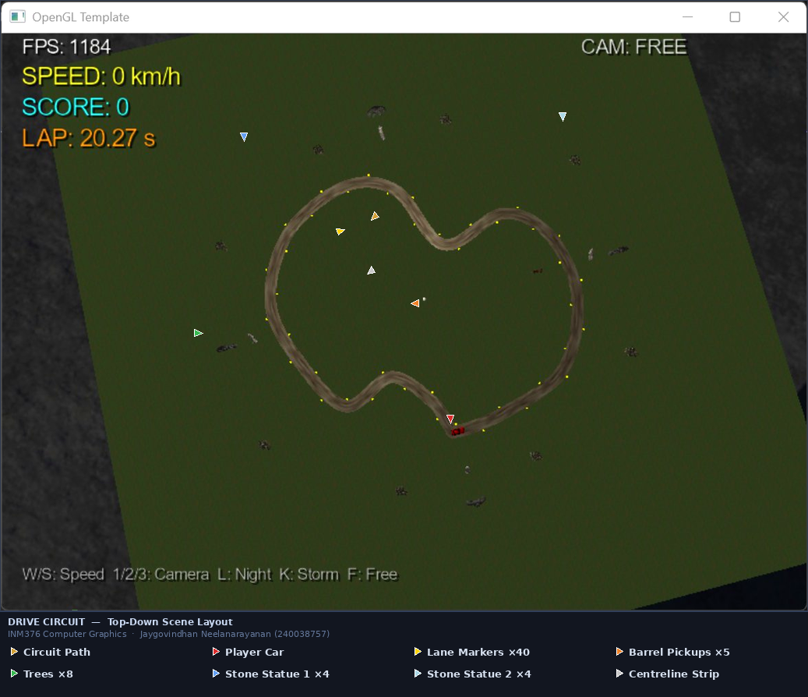

# Drive Circuit
A real-time F1-style racing game built in C++ with OpenGL 4.0 and GLSL shaders.
Developed as the final coursework for INM376 Computer Graphics at City St George's, University of London (2026).

---

## Features
- F1-style closed circuit built from a Catmull-Rom spline with arc-length parameterisation
- Procedurally generated road ribbon (GL_TRIANGLE_STRIP) from spline centreline
- Four camera modes — Free, First Person, Third Person, Top View
- Day / Night / Storm visual modes
- GLSL shaders — exponential fog, multi-texturing, animated rain streaks and lightning
- 40 animated diamond lane markers with per-marker spin and bob wave effect
- Two spotlights in night mode — white headlight tracking the car, orange fixed circuit light
- Barrel pickup collision detection with score and lap timer
- Drop shadow HUD rendered with FreeType

---

## Controls
| Key | Action |
|-----|--------|
| W | Accelerate |
| S | Brake |
| F | Free camera |
| 1 | First person camera |
| 2 | Third person camera |
| 3 | Top view camera |
| L | Toggle Night mode |
| K | Toggle Storm mode |
| ESC | Quit |

---

## How to Run

### Requirements
- Windows 10/11 x64
- Visual C++ Redistributable 2022 (x64)

### Running the pre-built exe
1. Navigate to `x64/Release/`
2. Run `OpenGLTemplate.exe`
3. The `resources/` folder must be in the same directory as the exe (it already is)

### Building from source
1. Open `OpenGLTemplate.sln` in Visual Studio 2022
2. Set configuration to **Release** and platform to **x64**
3. Press **Ctrl+Shift+B** to build
4. Copy the `resources/` folder from `OpenGLTemplate/resources/` into `x64/Release/`
5. Run `x64/Release/OpenGLTemplate.exe`

---

## Project Structure

OpenGLTemplate/
├── Game.cpp / Game.h — Main game loop, rendering, input
├── CatmullRom.cpp / .h — Spline generation and TNB frame
├── Track.cpp / .h — Road ribbon mesh from spline
├── Diamond.cpp / .h — Octagonal diamond primitive
├── resources/
│ ├── shaders/ — GLSL vertex and fragment shaders
│ ├── models/ — OBJ meshes (Car, Tree, Statue, Stone)
│ ├── textures/ — Road, terrain, detail textures
│ └── audio/ — Background music

---

## Assets Used
| Asset | Source | License |
|-------|--------|---------|
| Car.obj | free3d.com/3d-model/low-poly-car-40967.html | Free personal use |
| Tree.obj | free3d.com/3d-model/tree-74556.html | Free personal use |
| statue.obj | free3d.com/3d-model/statue-v1--541832.html | Free personal use |
| Stone.obj | free3d.com/3d-model/giant-stone-765391.html | Free personal use |
| Background music | nosoapradio.us | Free with attribution |
| OpenGL Template | Dr Eddie Edwards, City St George's | Academic use |

---

## Tech Stack
C++ · OpenGL 4.0 · GLSL · Assimp · FreeType · GLM · FMOD · Visual Studio 2022

---

## Course
INM376 Computer Graphics — City St George's, University of London (2026)  
Instructor: Dr. Eddie Edwards
